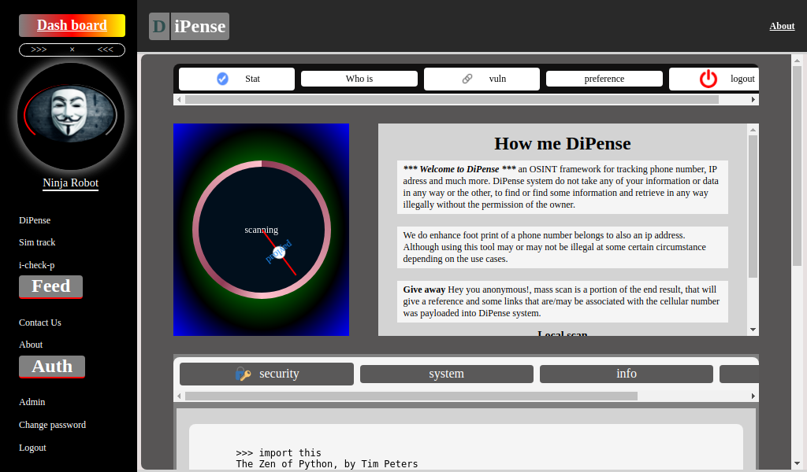
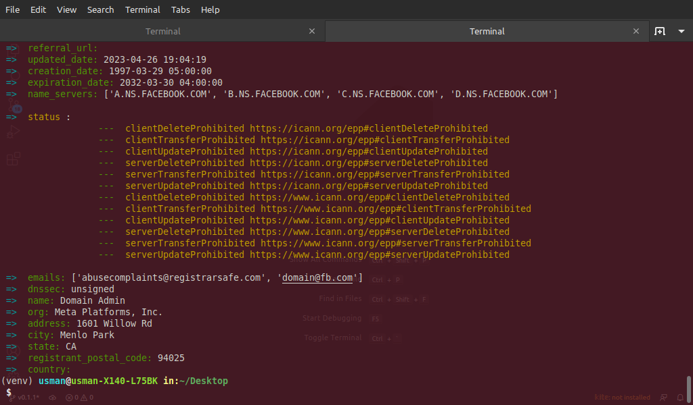

# DiPense

An OSINT tool for IT ninjas

# How me DiPense (Docker release)
To use this tool you have to make sure you have `docker` install as well as `docker-compose`, also make sure you have nothing running on port `8000` and `80` because these ports are going to be use for the services

After that then you are to pull the image from docker with

```
docker pull usmanmusa/dipense
```

Next you are to clone the github repo of the project in other to get the `docker-compose.yml` by:

```
git clone https://github.com/usmanmusa1920/dipense.git
```

Now cd into the project folder you just clone to spin up the services using the command::

```
docker-compose up
```

you can use the command below instead of the above, in other to see how it build the image::

```
docker-compose up --build
```

Once that finish, you will notice in your terminal that it says you can reach it at `http://0.0.0.0:8000`, that one is a gunicorn server which doesn't serve static files, we recommend visiting it at port `80` which is an `Nginx` server that can serve static files, and it is a proxy to that gunicorn container.

# How to use dipense (Pypi release)

First we recommend creating a virtual environment `python -m venv venv` and then activate it `source venv/bin/activate`

Once that finish now install the library using

```
pip install --upgrade dipense
```

Wait for the installation to finish, basically the library was uploaded using `sdist` (Source Distribution)

After that, create a new file let call it `route.py` in the file put the below code

```python
from dipense import payloads
from dipense.structure import helper


if __name__ == '__main__':
    payloads(helper)
```

save the file and navigate to where the file is located in terminal and your are ready to go

To find information about a domain name run the file like:

```
python route.py payloadwho -d google.com
```

or

```
python route.py payloadwho --domain google.com
```


To find information about an ip address run the file like so below, and the command require root previlage (super user):

```
python route.py payloadip -i 198.3.11.7
```

or

```
python route.py payloadip --ip 198.3.11.7
```

You can also specify a flag of `-o` or `--open` to `True` this will automatically open a webbrowser showing you where that ip address is located, like:

```
python route.py payloadip -i 198.3.11.7 -o True
```

or

```
python route.py payloadip -i 198.3.11.7 --open True
```


To find information about a phone number run the file like you see below, be sure to start with the country code of that phone number:

```
python route.py payloadnum -n +2349083513047
```

or

```
python route.py payloadnum --number +2349083513047
```


To see positional argument and flags available run the file without any flag or positional argument like:

```
python route.py
```

See more documentations <a href="https://dipense.readthedocs.io">here!</a>

## Useful links

- Documentation: https://dipense.readthedocs.io
- Pypi Release: https://pypi.org/project/dipense
- Docker Release: https://hub.docker.com/r/usmanmusa/dipense

## Build Status
- version 0.1.2

## DiPense at a glance (docker)



## DiPense at a glance (pypi)


