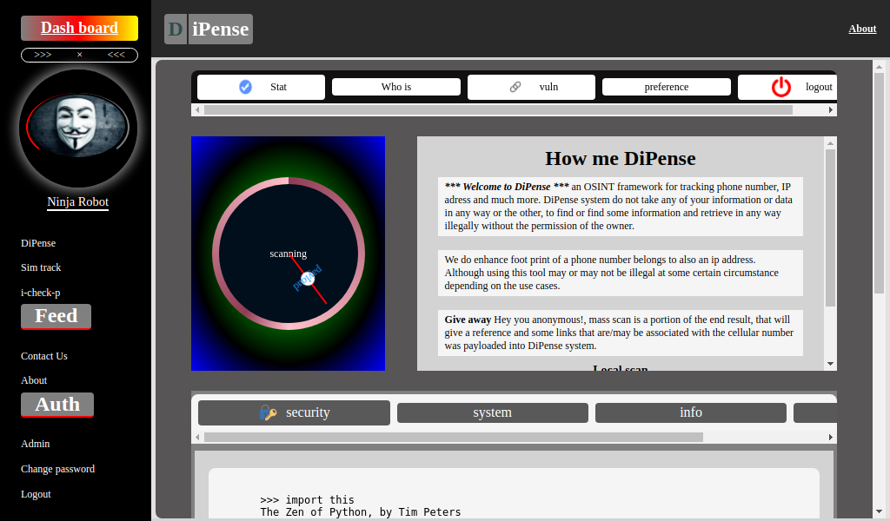

DiPense
=======

*** Welcome to DiPense *** An OSINT tool for IT ninjas, for reconnoitring phone number, ip address, DNS, and others. To be honest the application is free, beware with me your intent matter. **DiPense** system do not take any of your information or data in any way or the other, to find or find some information and retrieve in any way illegally without the permission of the owner.

How me DiPense
==============

To use this tool you have to make sure you have **docker** install as well as **docker-compose**, also make sure you have nothing running on port **8000** and **80** because these ports are going to be use for the services

After that then you are to pull the image from docker with::

    docker pull usmanmusa/dipense

Next you are to clone the github repo of the project::

    git clone https://github.com/usmanmusa1920/dipense.git

in other to get the **docker-compose.yml**

Now cd into the project folder you just clone to spin up the services using the command::

    docker-compose up

you can use::
    
    docker-compose up --build

in other to see how it build the image

Once that finish, you will notice in your terminal that it says you can reach it at **http://0.0.0.0:8000**, that one is a gunicorn server which doesn't serve static files,
we recommend visiting it at port **80** which is an **Nginx** server that can serve static files, and it is a proxy to that gunicorn container.

Look around
===========

You can install dipense from pypi using::

    pip install dipense

see `more <https://dipense-lib.readthedocs.io>`_ on how to use it

Give away
=========

Hey you anonymous!, **mass scan** is a portion of the end result, that will give a reference and some links that are/may be associated with the cellular number was payloaded into DiPense system.

Local scan
==========

It (local scan) is a portion (out come) of your payload, which will give a local format of the number that payloaded into the system, without showing the plus sign (+) i.e negating it unlike in internationall format.

Contact Us
==========

Give away Hey you anonymous! any complaint that you have to, feel free to deliver to us or something you found which is not support to be, we will response at the earliest via github issue (by pull comment). Our mission is to make IT more enthusiastic and more fun to IT ally.

Table of content
----------------

.. toctree::
  :maxdepth: 2

  library/index

Useful links:
=============

- `Repository <https://github.com/usmanmusa1920/dipense>`_

- `PYPI Release <https://pypi.org/project/dipense>`_

- `Docker-hub Release <https://hub.docker.com/r/usmanmusa/dipense>`_

Build Status
============

- version 0.1.1

DiPense at a glance
===================

